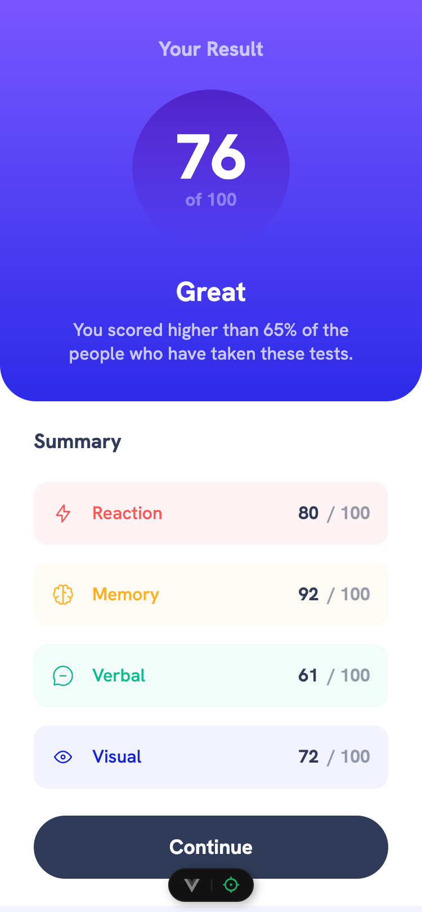
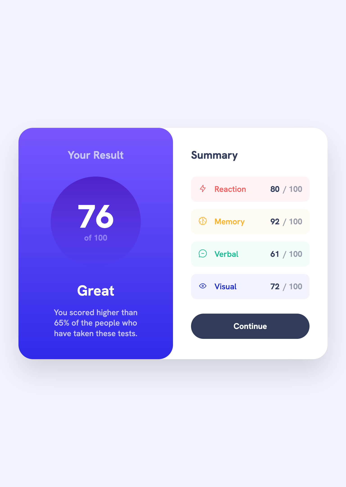
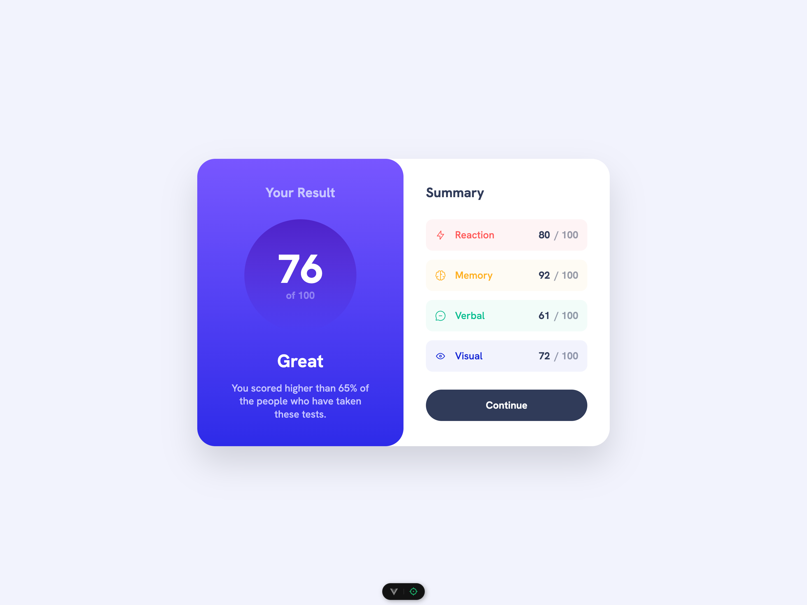

# Frontend Mentor - Results summary component solution

This is a solution to the [Results summary component challenge on Frontend Mentor](https://www.frontendmentor.io/challenges/results-summary-component-CE_K6s0maV). Frontend Mentor challenges help you improve your coding skills by building realistic projects.

## Table of contents

- [Overview](#overview)
  - [The challenge](#the-challenge)
  - [Screenshots](#screenshots)
  - [Links](#links)
- [My process](#my-process)
  - [Built with](#built-with)
  - [What I learned](#what-i-learned)
  - [Continued development](#continued-development)
  - [Useful resources](#useful-resources)
- [Author](#author)

## Overview

### The challenge

Users should be able to:

- View the optimal layout for the interface depending on their device's screen size
- See hover and focus states for all interactive elements on the page
- **Bonus**: Use the local JSON data to dynamically populate the content

### Screenshots

|        Mobile designed at 375px:         |        Tablet designed at 1440px:        | Desktop designed at 1440px:               |
| :--------------------------------------: | :--------------------------------------: | ----------------------------------------- |
|  |  |  |

### Links

- Solution URL: [https://github.com/elisilk/results-summary-component-v2](https://github.com/elisilk/results-summary-component-v2)
- Live Site URL: [https://elisilk.github.io/results-summary-component-v2/](https://elisilk.github.io/results-summary-component-v2/)

## My process

### Built with

- Semantic HTML5 markup
- CSS custom properties
- Flexbox
- CSS Grid
- Mobile-first workflow
- Accessibility
- [Vue.js](https://vuejs.org/)

### What I learned

As always, so many cool :sunglasses: things. Here are some of the key resources I used:

- 

### Continued development

Specific areas that the solution should be improved (known issues):

- [ ] Implement the difference in inline size of the two columns in the tablet view (uneven columns, column 1 is 338px and column 2 is 348px) compared to the desktop view (even columns, 368px each)
- [ ] Redo the implementation of the SVG icons so their color is tied to the custom property of the singular score component and their height is tied to the available height in the container

More general ideas I want to consider:

Hmm 🤔 ...

- What other key aspects/essential ideas of Vue should I be trying out, learning more about, and implementing?
- Should this GitHub repo really be a different version (or branch) located within/alongside the GitHub repo for the first solution? What do I need to learn about git and GitHub to make that work well?

### Useful resources

- [MDN Web Docs for CSS](https://developer.mozilla.org/en-US/docs/Web/CSS) - Went here a lot to reference the different CSS properties and the shorthands, and all the great explanations about best practices.

## Author

- Website - [Eli Silk](https://github.com/elisilk)
- Frontend Mentor - [@elisilk](https://www.frontendmentor.io/profile/elisilk)
