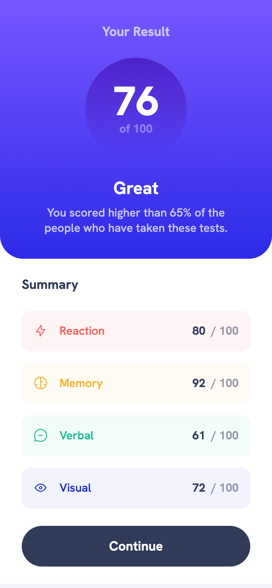
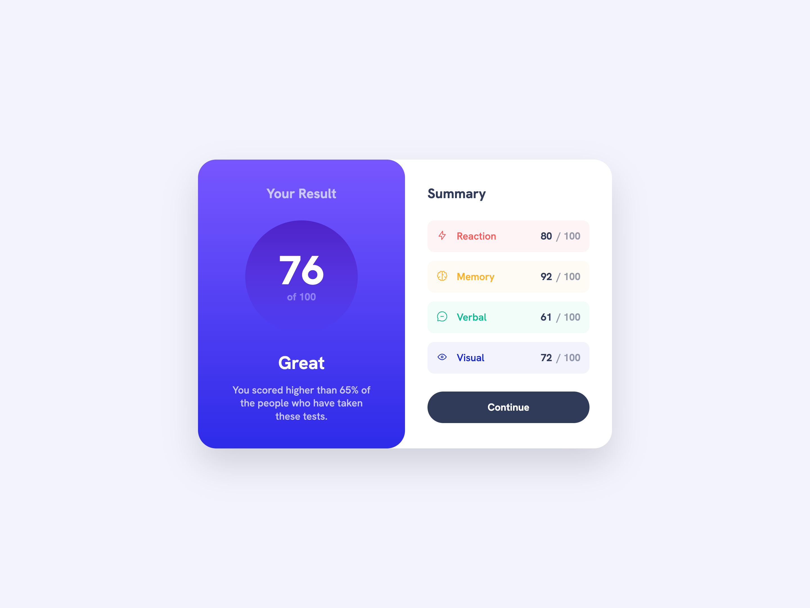

# Frontend Mentor - Results summary component solution

This is a solution to the [Results summary component challenge on Frontend Mentor](https://www.frontendmentor.io/challenges/results-summary-component-CE_K6s0maV). Frontend Mentor challenges help you improve your coding skills by building realistic projects.

This challenge was one that [I have completed before](https://www.frontendmentor.io/solutions/responsive-summary-component-with-import-of-data-to-populate-content-e7govS1bG7), much earlier in my web development learning journey. I was encouraged to revisit this challenge as part of the [JavaScript frameworks and libraries](https://www.frontendmentor.io/learning-paths/javascript-frameworks-and-libraries-JDWoqQjMyb) Frontend Mentor learning path. The learning path encouraged me to pick a modern JavaScript framewok and try it out, while also utilizing Node, npm, and Vite to set up, test, and deploy the JS framework. I chose to try out [Vue](https://vuejs.org/). Although React does seem to be the most popular JS framework, I was intrigued by Vue's templating approach that combines aspects of HTML, CSS, and JavaScript together. Vue also seems pretty approachable for a beginner while still having a high ceiling to continue to learn and build more advanced applications. I'd say it was a great first effort with Vue. I feel I learned a lot, and am intrigued about continuing to explore and learn what else I can do with Vue.

## Table of contents

- [Overview](#overview)
  - [The challenge](#the-challenge)
  - [Screenshots](#screenshots)
  - [Links](#links)
- [My process](#my-process)
  - [Built with](#built-with)
  - [What I learned](#what-i-learned)
  - [Continued development](#continued-development)
  - [Useful resources](#useful-resources)
- [Author](#author)

## Overview

### The challenge

Users should be able to:

- View the optimal layout for the interface depending on their device's screen size
- See hover and focus states for all interactive elements on the page
- **Bonus**: Use the local JSON data to dynamically populate the content

### Screenshots

|        Mobile designed at 375px:         |        Tablet designed at 1440px:        | Desktop designed at 1440px:               |
| :--------------------------------------: | :--------------------------------------: | ----------------------------------------- |
|  |  |  |

### Links

- Solution URL: [https://github.com/elisilk/results-summary-component-v2](https://github.com/elisilk/results-summary-component-v2)
- Live Site URL: [https://elisilk.github.io/results-summary-component-v2/](https://elisilk.github.io/results-summary-component-v2/)

## My process

### Built with

- Semantic HTML5 markup
- CSS custom properties
- Flexbox
- CSS Grid
- Mobile-first workflow
- Accessibility
- [Vue.js](https://vuejs.org/)

### What I learned

As always, so many cool :sunglasses: things. Here are some of the key resources I used:

- [Using CSS custom properties like this is a waste](https://www.youtube.com/watch?v=_2LwjfYc1x8&ab_channel=KevinPowell) - This is my go-to resource for using CSS custom properties to make slightly different versions of the same component, like I do with the singular scores in this challenge. I love how this works.
- [Container queries](https://developer.mozilla.org/en-US/docs/Web/CSS/CSS_containment/Container_queries) - I was a little unsure about when to use a media query and when to use a container query. I want to imagine that this "component" will be used within a larger application, and so I kind of want it to function independently within some larger page. That to me suggests container queries is more appropriate. But that mobile version takes up the full width of the viewport, whereas the tablet and desktop designs have a gutter and are block centered, and so that suggests to me more a media query approach. I ended up doing a bit of both, which doesn't feel perfect, but probably what I needed to do in this case.
- [Vue CLI HTML and Static Assets](https://cli.vuejs.org/guide/html-and-static-assets.html) - Probably the biggest stumbling block I had was just trying to figure out how to organize and link to the static images and other assets. I'm embarassed that it took me so long to figure out, and I still have questions. But at least I got it to work for now in this case.
  - [How to use images with Vite and Vue](https://medium.com/@andrewmasonmedia/how-to-use-images-with-vite-and-vue-937307a150c0)
  - [Vite Static Asset Handling](https://vite.dev/guide/assets.html)
  - [Vue Examples Working with Image Assets](https://skirtles-code.github.io/vue-examples/guides/working-with-image-assets)
- [Vue Class and Style Bindings](https://vuejs.org/guide/essentials/class-and-style)
- [Vite](https://vite.dev/)
  - [Vite Getting Started](https://vite.dev/guide/)
  - [Vite Deploying a Static Site](https://vite.dev/guide/static-deploy.html)
- More general Vue resources I took advantage of:
  - [Vue Tutorial](https://vuejs.org/tutorial/)
  - [Vue Guide](https://vuejs.org/guide/)
  - [Vue Examples](https://skirtles-code.github.io/vue-examples/)

### Continued development

Specific areas that the solution should be improved (known issues):

- [ ] Implement the difference in inline size of the two columns in the tablet view (uneven columns, column 1 is 338px and column 2 is 348px) compared to the desktop view (even columns, 368px each)
- [ ] Redo the implementation of the SVG icons so their color is tied to the custom property of the singular score component and their height is tied to the available height in the container

More general ideas I want to consider:

Hmm 🤔 ...

- What other key aspects/essential ideas of Vue should I be trying out, learning more about, and implementing?
- Should this GitHub repo really be a different version (or branch) located within/alongside the GitHub repo for the first solution? What do I need to learn about git and GitHub to make that work well?
- [How much JavaScript do you need to know to use Node.js?](https://nodejs.org/en/learn/getting-started/how-much-javascript-do-you-need-to-know-to-use-nodejs)
- [Typescript](https://www.typescriptlang.org/)
  - [TypeScript Tutorial](https://www.typescripttutorial.net/)
  - [Using Vue with TypeScript](https://vuejs.org/guide/typescript/overview)

### Useful resources

- [Vue Guide](https://vuejs.org/guide/)
- [Vite Guide](https://vite.dev/guide/)
- [MDN Web Docs for CSS](https://developer.mozilla.org/en-US/docs/Web/CSS) - Went here a lot to reference the different CSS properties and the shorthands, and all the great explanations about best practices.

## Author

- Website - [Eli Silk](https://github.com/elisilk)
- Frontend Mentor - [@elisilk](https://www.frontendmentor.io/profile/elisilk)
